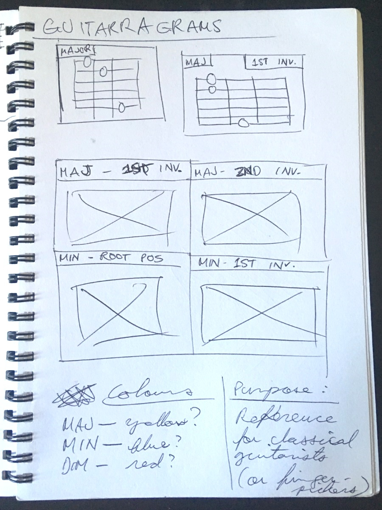
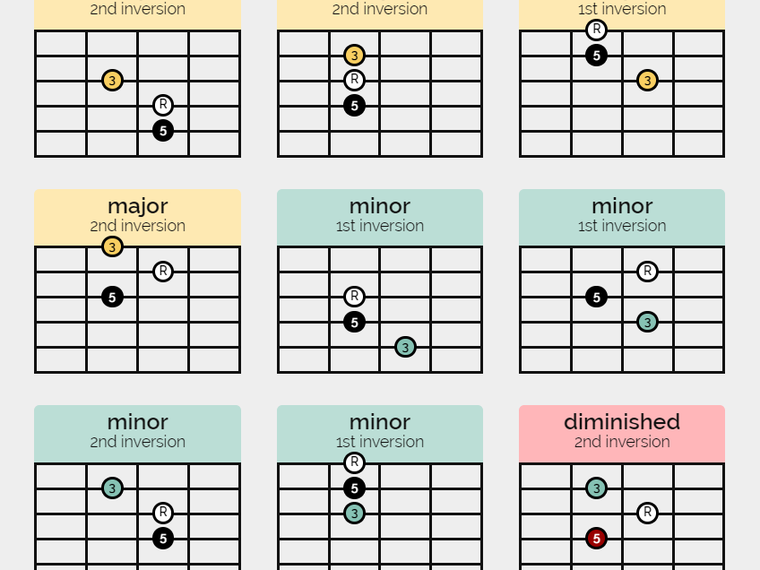

Earlier this year, I was studying chord patterns and wrote them into a document.
This was a PITA to update, so I made a web app out of it. <!-- more --> I took this opportunity to learn some tech, so I jumped on the Vue bandwagon. I found that the [Vue CLI tools](https://cli.vuejs.org/guide/creating-a-project.html) didn't get in my way,
and the Vue documentation made for a gentle learning curve.

## Tools used

- [VueJS](https://vuejs.org/) as the main framework

## Process

With this project, I needed to figure out two things, and all the hard stuff was finished in one afternoon:

1. Data format for the chord diagrams. I laid it out in a few JSON files here.
1. Vue component scheme. I settled for four components here:
    + ChordGroup
    + FretboardDiagram
    + FretboardMarker
    + PatternGroup

For someone already familiar with web dev frameworks and the Node stack, the view from Vue is majestic.

## Results

Take a look at [rjsalvadorr.github.io/guitarragrams/](https://rjsalvadorr.github.io/guitarragrams/)  
For more info, check out the project repository at [github.com/rjsalvadorr/guitarragrams](https://github.com/rjsalvadorr/guitarragrams)

I'm happy with this project! I still use it from time to time when I want to play around with chord voicings.
